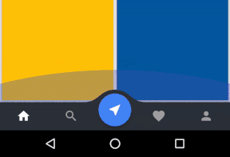
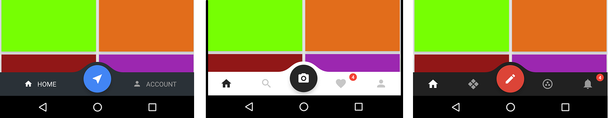
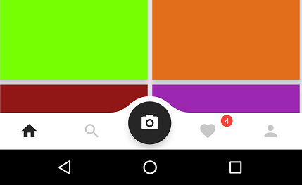
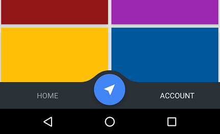
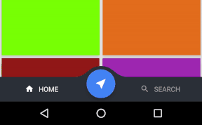
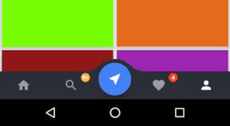
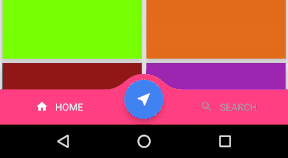

# Space-Navigation-View
[](https://android-arsenal.com/details/1/4180)
<a href='https://ko-fi.com/A654L70' target='_blank'></a> 

## Introduction
------------
Space Navigation is a library allowing easily integrate fully customizable Google [Spaces][1] like navigation to your app.
[1]: https://play.google.com/store/apps/details?id=com.google.android.apps.social.spaces





The current minSDK version is API level 14 Android 4.0 (ICE CREAM SANDWICH).

Download sample [apk][7]
[7]: https://github.com/armcha/Space-Navigation-View/raw/master/SpaceNavigationView.apk

# YouTube demos 

## Demo 1    
[](https://www.youtube.com/watch?v=LY-7abfJV2o)    
## Demo 2     
[](https://www.youtube.com/watch?v=rA1NMMLJ4TE)      

# Download magic
-----------------------


Gradle:
```groovy
compile 'com.github.armcha:SpaceNavigationView:1.6.0'
```
Maven:
```xml
<dependency>
  <groupId>com.github.armcha</groupId>
  <artifactId>SpaceNavigationView</artifactId>
  <version>1.6.0</version>
  <type>pom</type>
</dependency>
```

## Setup and usage
------------------

Add the Space Navigation view to your layout

```xml
 <FrameLayout xmlns:android="http://schemas.android.com/apk/res/android"
     xmlns:tools="http://schemas.android.com/tools"
     xmlns:app="http://schemas.android.com/apk/res-auto"
     android:layout_width="match_parent"
     android:layout_height="match_parent">
     
      <...View
             ....
             android:layout_marginBottom="@dimen/view_bottom_margin" />
             
      <com.luseen.spacenavigation.SpaceNavigationView
             android:id="@+id/space"
             android:layout_width="match_parent"
             android:layout_height="match_parent"
             android:layout_gravity="bottom"/>
             
 </FrameLayout>
```

Add Space Navigation items.

```java
   SpaceNavigationView spaceNavigationView = (SpaceNavigationView) findViewById(R.id.space);
   spaceNavigationView.initWithSaveInstanceState(savedInstanceState);
   spaceNavigationView.addSpaceItem(new SpaceItem("HOME", R.drawable.yourDrawable));
   spaceNavigationView.addSpaceItem(new SpaceItem("SEARCH", R.drawable.yourDrawable));
```

Use ```initWithSaveInstanceState(savedInstanceState)``` and override ```onSaveInstanceState``` 
if you want to keep selected item position and badge on device rotation
```java
       @Override
       protected void onSaveInstanceState(Bundle outState) {
           super.onSaveInstanceState(outState);
           spaceNavigationView.onSaveInstanceState(outState);
       }
```

Set onClick listener
```java
   spaceNavigationView.setSpaceOnClickListener(new SpaceOnClickListener() {
            @Override
            public void onCentreButtonClick() {
               Toast.makeText(MainActivity.this,"onCentreButtonClick", Toast.LENGTH_SHORT).show();
            }

            @Override
            public void onItemClick(int itemIndex, String itemName) {
               Toast.makeText(MainActivity.this, itemIndex + " " + itemName, Toast.LENGTH_SHORT).show();
            }
            
             @Override
             public void onItemReselected(int itemIndex, String itemName) {
               Toast.makeText(MainActivity.this, itemIndex + " " + itemName, Toast.LENGTH_SHORT).show();           
            }
        });
```

Set onLongClick listener
```java
    spaceNavigationView.setSpaceOnLongClickListener(new SpaceOnLongClickListener() {
            @Override
            public void onCentreButtonLongClick() {
                Toast.makeText(MainActivity.this,"onCentreButtonLongClick", Toast.LENGTH_SHORT).show();
            }

            @Override
            public void onItemLongClick(int itemIndex, String itemName) {
                Toast.makeText(MainActivity.this, itemIndex + " " + itemName, Toast.LENGTH_SHORT).show();
            }
        });
```

Customize
---------

Customize with xml

```xml
 <com.luseen.spacenavigation.SpaceNavigationView
        android:id="@+id/space"
        android:layout_width="match_parent"
        android:layout_height="match_parent"
        android:layout_gravity="bottom"
        app:active_item_color="@color/colorAccent"
        app:centre_button_color="@color/centre_button_color"
        app:inactive_item_color="@color/white"
        app:space_background_color="@color/colorPrimary"
        app:centre_button_icon="@drawable/my_drawable"
        app:space_item_icon_size="@dimen/space_item_icon_default_size"
        app:space_item_icon_only_size="@dimen/space_item_icon_only_size"
        app:space_item_text_size="@dimen/space_item_text_default_size" />
```

|  Attribute | Description |
|---|---|
| active_item_color  | item color when selected |
| inactive_item_color |  item color when unselected |
| centre_button_color | centre circle button color |
| space_background_color | space view background color |
| space_item_icon_size | item icon size |
| space_item_icon_only_size | item icon size on ```showIconOnly()``` mode |
| space_item_text_size | item text size |
| centre_button_icon | allow changing center icon from layout |

Change space navigation background
```java
spaceNavigationView.setSpaceBackgroundColor(ContextCompat.getColor(this, R.color.yourColor));
```

Change centre button icon 
```java
spaceNavigationView.setCentreButtonIcon(R.drawable.yourDrawable);
```

Change centre button background color 
```java
spaceNavigationView.setCentreButtonColor(ContextCompat.getColor(this, R.color.yourColor));
```

Change selected item text and icon color
```java
spaceNavigationView.setActiveSpaceItemColor(ContextCompat.getColor(this, R.color.yourColor));
```

Change unselected item text and icon color
```java
spaceNavigationView.setInActiveSpaceItemColor(ContextCompat.getColor(this, R.color.yourColor));
```

Change space item icon size
```java
spaceNavigationView.setSpaceItemIconSize((int) getResources().getDimension(R.dimen.yourDimen));
```

Change space item icon size when ```showIconOnly();``` mode activated
```java
spaceNavigationView.setSpaceItemIconSizeInOnlyIconMode((int) getResources().getDimension(R.dimen.yourDimen));
```

Change space item text size
```java
spaceNavigationView.setSpaceItemTextSize((int) getResources().getDimension(R.dimen.yourDimen));
```

Hide items text and show only icons
```java
spaceNavigationView.showIconOnly();
```


Hide items icon and show only texts
```java
spaceNavigationView.showTextOnly();
```


You can change selected item programmatically
```java
spaceNavigationView.changeCurrentItem(int tabIndexToSelect);
```

Show badge
```java
spaceNavigationView.showBadgeAtIndex(int itemIndexToShowBadge, int badgeCountText, int badgeBackgroundColor);
```


Hide badge at index
```java
spaceNavigationView.hideBadgeAtIndex(int itemIndexToHideBadge);
```


Hide all badges
```java
spaceNavigationView.hideAllBadges();
```

Change badge text
```java
spaceNavigationView.changeBadgeTextAtIndex(int itemIndexToChangeBadge, int badgeCountText);
```

Set your custom font
```java
spaceNavigationView.setFont(Typeface.createFromAsset(getAssets(), "your_cutom_font.ttf"));
```

Set centre button pressed state color
```java
spaceNavigationView.setCentreButtonRippleColor(ContextCompat.getColor(this, R.color.yourColor));
```

Now you can change centre button icon if space navigation view already set up
```java
spaceNavigationView.changeCenterButtonIcon(R.drawable.yourDrawable);
```

Also you can change item text and icon  if space navigation view already set up
```java
spaceNavigationView.changeItemTextAtPosition(0, "NEW TEXT");
spaceNavigationView.changeItemIconAtPosition(1, R.drawable.yourDrawable);
```

Now you can change space navigation view background color if it already set up
```java
 spaceNavigationView.changeSpaceBackgroundColor(ContextCompat.getColor(context,R.color.yourColor));
```


If you want to show full badge text or show 9+
```java
spaceNavigationView.shouldShowFullBadgeText(true);
```

Set centre button icon color
```java
spaceNavigationView.setCentreButtonIconColor(ContextCompat.getColor(context,R.color.yourColor));
```
If you want to disable default white color filter, just call
```java
spaceNavigationView.setCentreButtonIconColorFilterEnabled(false);
```

Add recycler view scroll behavior
```groovy
<?xml version="1.0" encoding="utf-8"?>
<android.support.design.widget.CoordinatorLayout xmlns:android="http://schemas.android.com/apk/res/android"
    xmlns:app="http://schemas.android.com/apk/res-auto"
    xmlns:tools="http://schemas.android.com/tools"
    android:id="@+id/main_content"
    android:layout_width="match_parent"
    android:layout_height="match_parent"
    tools:context="com.luseen.spacenavigationview.MainActivity">

    <android.support.v7.widget.RecyclerView
        android:id="@+id/recyclerView"
        android:layout_width="match_parent"
        android:layout_height="match_parent" />

    <com.luseen.spacenavigation.SpaceNavigationView
        android:id="@+id/space"
        android:layout_width="match_parent"
        android:layout_height="wrap_content"
        android:layout_gravity="bottom"
        app:layout_behavior="com.luseen.spacenavigation.SpaceNavigationViewBehavior" />
</android.support.design.widget.CoordinatorLayout>
```

[10]: https://github.com/armcha/Space-Navigation-View/issues/16
[11]: https://github.com/armcha/Space-Navigation-View/issues/18
[12]: https://github.com/armcha/Space-Navigation-View/issues/17
[13]: https://github.com/armcha/Space-Navigation-View/issues/25
[14]: https://github.com/armcha/Space-Navigation-View/issues/29
[16]: https://github.com/armcha/Space-Navigation-View/issues/34
[17]: https://github.com/armcha/Space-Navigation-View/issues/32
[20]: https://github.com/armcha/Space-Navigation-View/issues/41
[15]: https://github.com/ankitpopli1891
[18]: https://github.com/akiraspeirs
[19]: https://github.com/nextdimension

##Versions

##1.6.0
* Added saving translation height on rotation. Thanks to [akiraspeirs][18]
* Fixed requestLayout being improperly called. Thanks to [akiraspeirs][18]
* Fixed inActiveCentreButtonIconColor not being used initially. Thanks to [nextdimension][19]
* Fixed issue [#41][20]

## 1.5.0
* Added SpaceNavigationViewBehavior
* Fixed issue [#32][17]

## 1.4.2
* Fixed issue [#34][16]

## 1.4.1
* Changing center icon from layout
* Fixed issue [#29][14] Thanks to [ankitpopli1891][15]

## 1.4.0
* Added method do disable centre button default color filter
* Fixed issue [#25][13]

## 1.3.2
* Added method setCentreButtonIconColor [#17][12]

## 1.3.1
* Added method shouldShowFullBadgeText
* Fixed issue [#16][10] , [#18][11]

## 1.3.0
* Added SpaceOnLongClickListener
* Added changeSpaceBackgroundColor method
* Fixed rendering problem when view is in edit mode

## 1.2.0
* Fixed centre button issue
* Added API 14+ support

## 1.1.0 
* Added ```changeItemTextAtPosition, changeItemIconAtPosition, changeCenterButtonIcon,setCentreButtonRippleColor``` methods
* Now you can set onItemReselect listener

## 1.0.0
* Initial release

## Apps using the Space Navigation View
* [Book Share - Share Ebooks and files](https://play.google.com/store/apps/details?id=com.rvnd.bookshare)
* [WiFi FTP Server +File Transfer](https://play.google.com/store/apps/details?id=com.transfer.file)

Kindly please let me know if you used or planning to use the library in your projects

##Project development
Some crazy [pics][8]
[8]: https://github.com/armcha/Space-Navigation-View/tree/master/development

## Contact 

Pull requests are more than welcome.
Please fell free to contact me if there is any problem when using the library.

- **Email**: armcha01@gmail.com
- **Facebook**: https://web.facebook.com/chatikyana
- **Twitter**: https://twitter.com/ArmanChatikyan
- **Google +**: https://plus.google.com/112011638040018774140
- **Website**: https://armcha.github.io/

License
--------


      Space Navigation library for Android
      Copyright (c) 2016 Arman Chatikyan (https://github.com/armcha/Space-Navigation-View).
      
      Licensed under the Apache License, Version 2.0 (the "License");
      you may not use this file except in compliance with the License.
      You may obtain a copy of the License at

         http://www.apache.org/licenses/LICENSE-2.0

      Unless required by applicable law or agreed to in writing, software
      distributed under the License is distributed on an "AS IS" BASIS,
      WITHOUT WARRANTIES OR CONDITIONS OF ANY KIND, either express or implied.
      See the License for the specific language governing permissions and
      limitations under the License.
    
